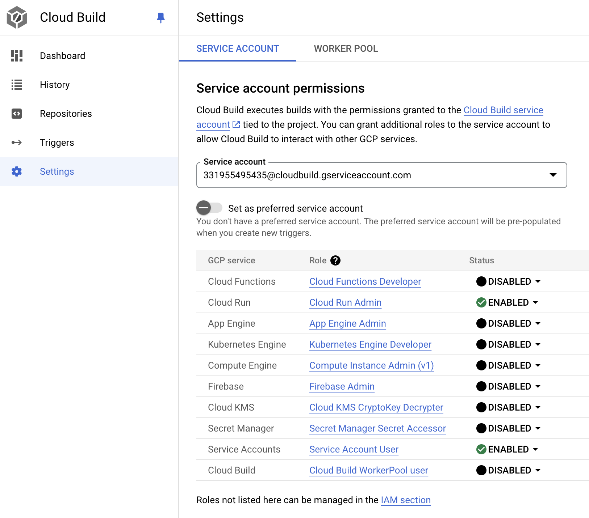

# Livekit Token Endpoint

A web service in Rust on Cloud Run that creates a token for use with LiveKit.

Uses Cloud Build to deploy to Cloud Run.

The following excellent blogposts explain in more detail how to set things up:

- [https://jgunnink.substack.com/p/rustless-serverless-rust](https://jgunnink.substack.com/p/rustless-serverless-rust)
- [https://blog.logrocket.com/packaging-a-rust-web-service-using-docker](https://blog.logrocket.com/packaging-a-rust-web-service-using-docker)

## Set the GCP project

```sh
gcloud config get-value project
gcloud projects list
gcloud config set project <project_id>
```

## Enable APIs

Make sure Cloud Run Admin and Cloud Build APIs are enabled on the GCP project.

## Set required permissions

Give the Cloud Build service account permissions to deploy to Cloud Run.



## Deploy

```sh
gcloud builds submit .
```

## Add Required Environment Variables

```sh
gcloud run services update livekit-token-endpoint --update-env-vars LIVEKIT_API_KEY=VALUE1,LIVEKIT_API_SECRET=VALUE2
```

The values are available when you create a key at `https://cloud.livekit.io/projects/<project_id>/settings/keys`
